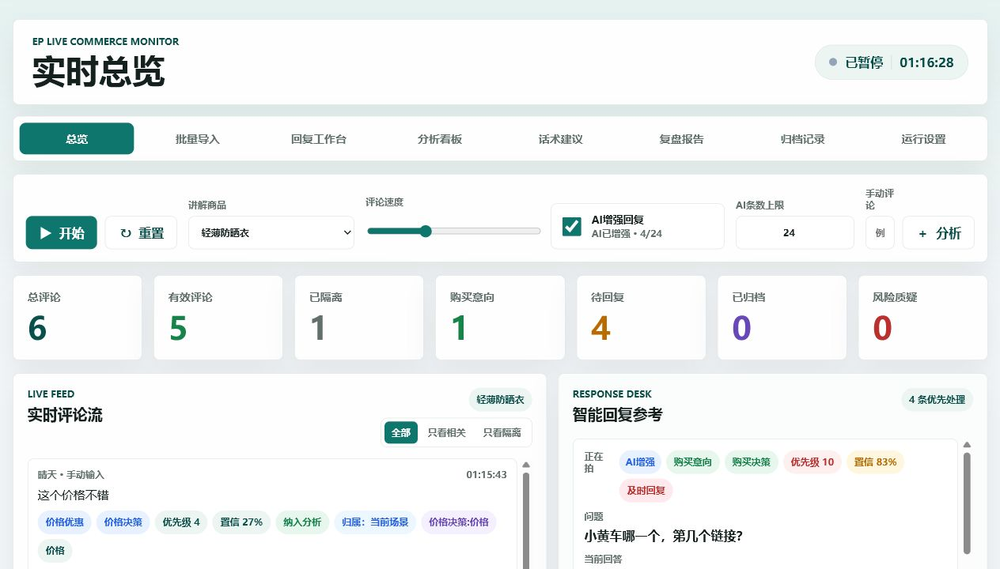
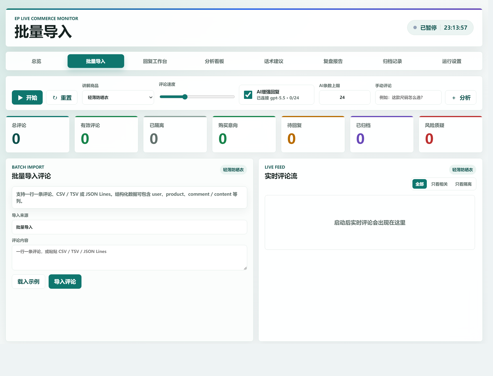
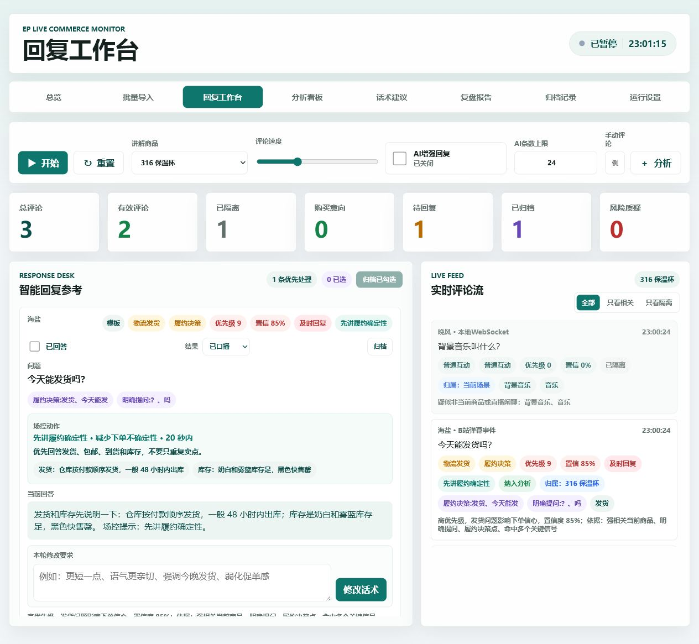
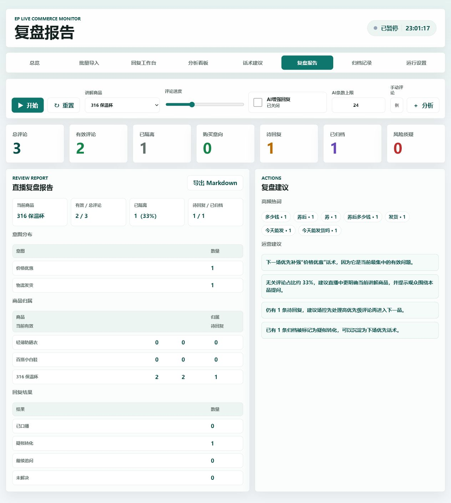

# EP Live Comment Analyzer

EP 是一个面向直播带货场景的实时评论分析与智能回复参考工具。它可以模拟或导入直播间评论流，识别评论意图、购买信号、风险质疑和商品相关性，并为主播或场控生成可直接参考的回复话术。

项目支持纯本地模板模式，也支持通过 OpenAI-compatible API 进行 AI 增强回复和多轮话术修改。

## 界面预览

以下截图使用本地模拟评论生成，不包含真实直播数据或任何 API 密钥。

### 实时总览



### 批量导入



### 回复工作台



### 复盘报告



## 功能特性

- 实时评论流模拟：可调评论速度，支持暂停、重置和手动评论分析。
- 批量评论导入：支持一行一条评论，也支持 CSV / TSV 格式。
- 评论意图识别：覆盖购买意向、价格优惠、规格尺码、库存颜色、物流发货、质量售后、风险质疑和普通互动。
- 商品相关性过滤：区分当前讲解商品、其他商品问题和直播间噪声，避免跑题评论干扰指标。
- 智能回复参考：先生成本地模板回复，AI 可用时自动增强为更自然的话术。
- AI 多轮修改：可对单条回复输入修改要求，例如更短、更亲切、弱化促单或强调发货。
- 回复归档：将已处理回复归档，并支持搜索、筛选和导出 CSV。
- 实时看板：展示评论量、有效评论、待回复、购买信号、风险质疑、高频热词和场控提醒。
- 话术建议：根据当前商品、热词和意图分布生成下一分钟讲解重点。
- 复盘报告：汇总直播过程指标，并支持导出 Markdown 报告。
- 本地持久化：使用浏览器 localStorage 保存工作台状态和 AI 请求上限。

## 技术栈

- 前端：Vue 3、Vue Router、Vite
- 后端：Python 标准库 HTTP 服务
- AI 接口：OpenAI-compatible Chat Completions API
- 数据存储：浏览器 localStorage，本地私有配置文件或环境变量

## 项目结构

```text
EP/
├── .editorconfig
├── .gitattributes
├── api.example.json
├── docs/
│   └── images/
│       ├── import.png
│       ├── overview.png
│       ├── reply-desk.png
│       └── report.png
├── index.html
├── package.json
├── package-lock.json
├── requirements.txt
├── vite.config.js
├── server.py
├── styles.css
├── src/
│   ├── main.js
│   ├── App.vue
│   ├── router/
│   │   └── index.js
│   ├── runtime/
│   │   ├── liveCommentRuntime.js
│   │   └── filterStrategy.js
│   ├── components/
│   │   ├── ArchiveList.vue
│   │   ├── CommentFeed.vue
│   │   ├── IntentPanel.vue
│   │   ├── ProductPanel.vue
│   │   ├── ReplyDesk.vue
│   │   └── SignalPanel.vue
│   └── pages/
│       ├── AnalysisPage.vue
│       ├── ArchivePage.vue
│       ├── DeskPage.vue
│       ├── ImportPage.vue
│       ├── OverviewPage.vue
│       ├── ReportPage.vue
│       ├── ScriptPage.vue
│       └── SettingsPage.vue
└── README.md
```

`dist/`、`node_modules/`、缓存目录和 Python 字节码文件已在 `.gitignore` 中排除，不建议提交到 GitHub。

## 环境要求

- Node.js 18 或更高版本
- npm
- Python 3.10 或更高版本

Python 后端依赖见 `requirements.txt`。当前版本只使用 Python 标准库，没有额外第三方 Python 包。

## 快速开始

在 README 所在目录执行以下命令。

### 1. 安装前端依赖

```powershell
npm install
```

如果 npm 全局缓存目录权限异常，可以使用项目本地缓存：

```powershell
npm install --cache .\.npm-cache
```

### 2. 启动后端服务

可选：安装 Python 依赖。当前文件中没有第三方依赖，执行该命令不会安装额外包，但可以作为统一初始化步骤保留。

```powershell
python -m pip install -r requirements.txt
```

启动本地 API 服务：

```powershell
npm run backend
```

默认服务地址：

```text
http://127.0.0.1:8765
```

如果不使用 npm 脚本，也可以直接运行：

```powershell
python server.py
```

### 3. 启动前端开发服务

另开一个终端，在同一目录执行：

```powershell
npm run dev
```

打开浏览器访问：

```text
http://127.0.0.1:5173/
```

开发模式下，Vite 会把 `/api` 请求代理到 `http://127.0.0.1:8765`。

## 生产构建

构建前端静态文件：

```powershell
npm run build
```

构建完成后，`server.py` 会优先服务 `dist/` 中的生产文件。启动后访问：

```text
http://127.0.0.1:8765/index.html
```

## AI 配置

不配置 AI 时，项目仍可使用本地模板回复。配置 AI 后，高优先级评论会自动请求 AI 增强回复，手动修改话术也会调用 AI。

默认配置文件路径相对于 `server.py` 所在目录：

```text
../api.json
```

建议把 `api.json` 放在项目目录外，或确保它不会被提交到公开仓库。

仓库提供了 `api.example.json` 作为模板。默认情况下可以复制为上级目录的 `api.json` 后再填写本地密钥。

示例配置：

```json
{
  "apiKey": "your-api-key",
  "apiBase": "https://your-openai-compatible-endpoint/v1",
  "model": "gpt-4o-mini",
  "timeout": 30
}
```

字段说明：

| 字段 | 必填 | 说明 |
| --- | --- | --- |
| `apiKey` | 是 | API 密钥，只应保存在本地私有文件或环境变量中。 |
| `apiBase` | 否 | OpenAI-compatible API 地址，默认是 `https://api.openai.com/v1`。 |
| `model` | 否 | 模型名称，默认是 `gpt-4o-mini`。 |
| `timeout` | 否 | 请求超时时间，单位为秒，默认是 `30`。 |

也可以使用环境变量覆盖配置：

```powershell
$env:EP_AI_CONFIG="..\api.json"
$env:EP_AI_API_KEY="your-api-key"
$env:EP_AI_API_BASE="https://your-openai-compatible-endpoint/v1"
$env:EP_AI_MODEL="gpt-4o-mini"
$env:EP_AI_TIMEOUT="30"
python server.py
```

配置优先级：

```text
环境变量 > api.json > 默认值
```

## 后端接口

### GET `/api/health`

检查本地服务是否正常运行。

示例：

```powershell
Invoke-WebRequest -Uri "http://127.0.0.1:8765/api/health" -UseBasicParsing
```

返回示例：

```json
{
  "ok": true,
  "service": "ep-live-comment-analyzer",
  "staticRoot": "source",
  "aiConfigured": false
}
```

### GET `/api/status`

检查 AI 配置状态。

示例：

```powershell
Invoke-WebRequest -Uri "http://127.0.0.1:8765/api/status" -UseBasicParsing
```

返回示例：

```json
{
  "configured": true,
  "model": "gpt-4o-mini",
  "apiBase": "OpenAI 官方接口",
  "configSource": "api.json"
}
```

接口不会返回 API key，也不会暴露真实中转站域名。

### POST `/api/reply`

根据评论、意图、商品信息和近期评论生成直播回复参考。

核心请求字段：

```json
{
  "comment": "主播，这个身高 168 体重 115 选什么码？",
  "intentLabel": "规格尺码",
  "product": {
    "name": "轻薄防晒衣",
    "price": "到手 79 元",
    "coupon": "直播间领 20 元券",
    "specs": "S 到 2XL",
    "shipping": "今晚 23 点前下单，48 小时内发货"
  },
  "recentComments": ["多少钱", "今天能发货吗"]
}
```

返回示例：

```json
{
  "reply": "168、115 斤可以先按平时外套尺码选，想宽松拍大一码，今晚 23 点前下单 48 小时内发。",
  "source": "ai",
  "model": "gpt-4o-mini"
}
```

### POST `/api/revise`

根据当前回复和本轮修改要求，重新生成话术。

核心请求字段：

```json
{
  "comment": "今天能发货吗？",
  "currentReply": "今晚 23 点前下单 48 小时内发货。",
  "revisionInstruction": "更口语化一点，适合主播快速说",
  "intentLabel": "物流发货",
  "product": {
    "name": "轻薄防晒衣",
    "shipping": "今晚 23 点前下单，48 小时内发货"
  },
  "revisionHistory": []
}
```

## 批量导入格式

支持直接粘贴一行一条评论：

```text
这个还有白色吗
主播今天能不能发货
168 115 斤选什么码
```

也支持 CSV / TSV。推荐包含以下字段：

```csv
user,product,comment
小秋,轻薄防晒衣,这个还有白色吗
阿圆,轻薄防晒衣,今天能不能发货
```

`product` 字段会优先作为商品归属依据，用于区分当前商品评论和其他商品评论。

## 页面说明

| 页面 | 路由 | 说明 |
| --- | --- | --- |
| 实时总览 | `#/overview` | 查看实时评论、指标、热词和提醒。 |
| 批量导入 | `#/import` | 粘贴历史评论或 CSV / TSV 数据。 |
| 回复工作台 | `#/desk` | 查看待回复评论、AI 话术、修改记录和归档操作。 |
| 分析看板 | `#/analysis` | 查看意图分布和评论质量。 |
| 话术建议 | `#/script` | 生成下一分钟讲解重点和可口播短句。 |
| 复盘报告 | `#/report` | 查看直播复盘指标并导出 Markdown。 |
| 归档记录 | `#/archive` | 搜索、筛选和导出已回答内容。 |
| 运行设置 | `#/settings` | 查看 AI 状态、请求额度和本地运行状态。 |

## 常见问题

### 页面提示未配置 API key

这不影响模板模式使用。如果需要 AI 增强，请检查：

- `../api.json` 是否存在，或是否设置了 `EP_AI_CONFIG`。
- JSON 格式是否正确。
- `apiKey` 是否非空。
- 是否通过 `python server.py` 启动了后端。

### `/api/reply` 返回 401

通常是 API key 与当前 `apiBase` 不匹配，或密钥已经过期。请检查服务商后台、模型权限和接口地址。

### `/api/reply` 返回 403 或被 Cloudflare 拦截

说明当前 API 服务商可能限制了请求来源或网络环境。可以更换服务商地址、使用官方接口，或改用服务商推荐的网关。

### 端口 8765 被占用

可以通过环境变量改端口：

```powershell
$env:EP_PORT="9000"
python server.py
```

然后访问：

```text
http://127.0.0.1:9000/index.html
```

## 安全提醒

- 不要把真实 API key 写进 README、前端源码或公开截图。
- 不要提交 `api.json`、`.env` 或任何包含密钥的文件。
- 如果密钥曾经出现在公开仓库、聊天记录或截图中，建议立即在服务商后台撤销并重新生成。
- 前端不会直接读取密钥，AI 请求统一由本地 `server.py` 代理。

## 后续可扩展方向

- 接入真实直播平台的授权评论流。
- 增加商品知识库导入和多商品自动匹配。
- 增加团队账号、场控协作和权限管理。
- 增加真实成交、点击、停留等数据，形成评论到转化的分析闭环。
- 增加回复效果评估，用历史归档数据优化话术策略。
- 增加部署方案，例如 Docker、云服务器或内网工具部署。

## 许可证

当前仓库尚未指定开源许可证。公开发布前，建议根据用途补充 `LICENSE` 文件。
