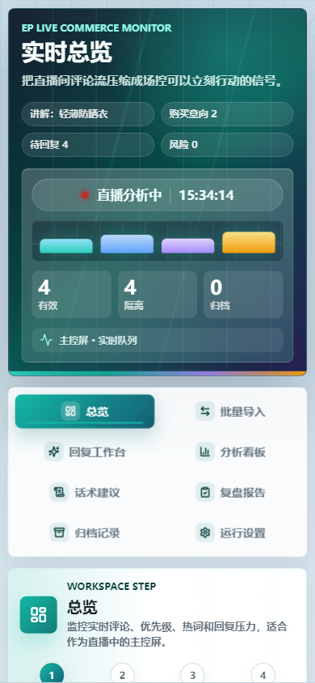

# EP Live Comment Analyzer

EP 是一个面向直播带货场景的实时评论分析与智能回复参考工具。项目使用 Vue 3 + Vite 构建前端工作台，支持实时评论流模拟、评论意图识别、优先级排序、回复建议、批量导入、归档复盘和多页面跳转。

当前版本重点优化了网页视觉效果：顶部直播驾驶舱、状态信号面板、页面流程导航、图标化操作入口、卡片层次、评论/回复优先级高亮，以及桌面和移动端响应式布局。

## 界面预览

以下截图使用本地模拟评论生成，不包含真实直播数据、用户隐私或 API 密钥。

### 实时总览


### 移动端总览



### 批量导入


### 回复工作台


### 复盘报告


## 功能特性

- 多页面工作台：总览、批量导入、回复工作台、分析看板、话术建议、复盘报告、归档记录和运行设置。
- 页面跳转体验：顶部导航、当前页面说明、流程进度点、上一页/下一页快捷跳转和路由过渡动画。
- 实时评论流：可启动、暂停、重置，支持手动输入评论进行即时分析。
- 评论识别：自动判断购买意向、价格优惠、规格尺码、库存颜色、物流发货、质量售后、风险质疑和普通互动。
- 优先级排序：价格、购买、尺码、库存、物流、风险等需要及时回复的问题会进入回复队列。
- 智能回复参考：本地模板先兜底，AI 服务可用时再生成更自然的话术。
- 批量导入：支持一行一条评论、CSV / TSV 和 JSON Lines。
- 商品资料配置：可维护价格、优惠、规格、库存、发货、售后和相关关键词。
- 复盘沉淀：支持已回复归档、回复结果标记和 Markdown 复盘导出。

## 技术栈

- Vue 3
- Vue Router
- Vite
- Lucide Vue 图标
- Python 标准库本地 API 代理
- 原生 CSS 响应式布局

## 快速开始

```powershell
cd E:\sheep\EP
npm install
npm run dev
```

打开：

```text
http://127.0.0.1:5173
```

生产构建：

```powershell
npm run build
npm run preview
```

## AI 增强回复

前端默认可以在模板模式下独立运行。需要 AI 增强回复时，启动本地 Python 服务：

```powershell
python server.py
```

默认读取相对路径：

```text
../api.json
```

建议参考 `api.example.json` 新建自己的本地配置文件，不要提交真实密钥。

## 必备依赖

前端依赖由 `package.json` 管理。

Python 后端仅使用标准库，`requirements.txt` 保留为空依赖说明，方便部署环境识别。

## 页面路由

| 页面 | 路由 | 用途 |
| --- | --- | --- |
| 实时总览 | `#/overview` | 查看实时评论、核心指标、热词、风险和回复压力。 |
| 批量导入 | `#/import` | 导入历史直播评论或运营样本。 |
| 回复工作台 | `#/desk` | 集中处理高价值评论和回复建议。 |
| 分析看板 | `#/analysis` | 查看意图分布、风险提醒和商品事实。 |
| 话术建议 | `#/script` | 生成下一段讲解重点和口播短句。 |
| 复盘报告 | `#/report` | 汇总本场数据并导出 Markdown。 |
| 归档记录 | `#/archive` | 检索已处理评论和回复结果。 |
| 运行设置 | `#/settings` | 编辑商品资料和关键词。 |

## 项目结构

```text
EP/
├─ index.html
├─ package.json
├─ requirements.txt
├─ server.py
├─ styles.css
├─ vite.config.js
├─ docs/
│  └─ images/
├─ scripts/
│  ├─ check-adapter.mjs
│  ├─ check-import.mjs
│  └─ check-priority.mjs
└─ src/
   ├─ App.vue
   ├─ main.js
   ├─ router/
   ├─ pages/
   ├─ components/
   └─ runtime/
```

## 检查命令

```powershell
npm run build
npm run check:priority
npm run check:import
npm run check:adapter
```

## 设计优化记录

- 顶部从普通标题栏升级为直播驾驶舱，强化实时状态、当前商品和核心信号。
- 页面导航增加图标、激活态、流程进度点和上下页快捷跳转。
- 关键指标卡加入状态色、图标标识和视觉层级。
- 评论流和回复队列增加紧急/高优先级视觉状态。
- 控制区拆分主控操作和手动评论输入，减少宽屏挤压。
- 移动端压缩顶部信息，保持 390px 宽度下无横向溢出。
- 支持减少动态效果的系统设置，降低动效干扰。

## 安全提醒

- 不要把真实 API key 写进 README、前端源码或公开截图。
- 不要提交 `api.json`、`.env` 或任何包含密钥的文件。
- 如果密钥曾经出现在公开仓库、聊天记录或截图中，建议立即在服务商后台撤销并重新生成。
- 前端不会直接读取密钥，AI 请求统一由本地 `server.py` 代理。

## 后续可扩展方向

- 接入真实直播平台评论流适配器。
- 增加评论情绪趋势和分钟级节奏曲线。
- 增加主播/场控协同视图。
- 增加可配置的商品话术模板库。
- 增加导出 CSV、JSON 和更完整的复盘报告。
